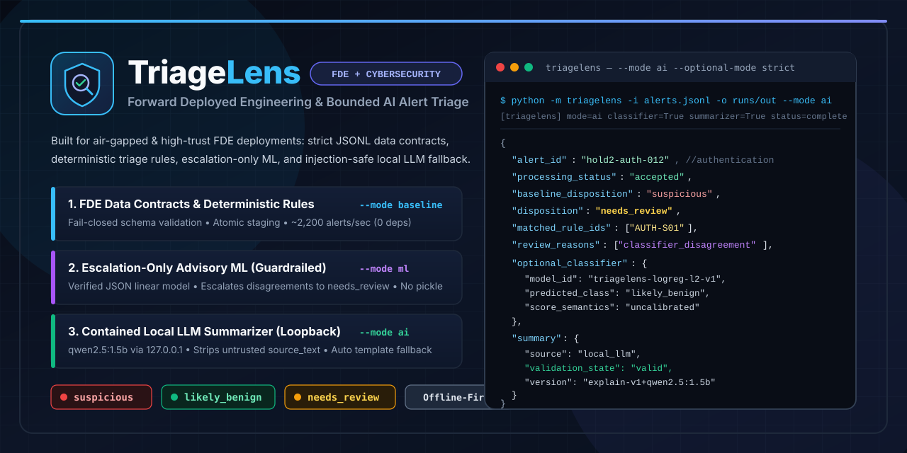

# TriageLens: Forward Deployed Engineering (FDE) + Cybersecurity Alert Triage CLI

<p align="center">
  
</p>

> **Project Positioning — Forward Deployed Engineering (`FDE`) + Cybersecurity:**  
> **TriageLens** is an **FDE + Cybersecurity** systems engineering project, not a full-scale commercial SIEM or EDR appliance. It demonstrates how a Forward Deployed Engineer designs **reliable data contracts, fail-closed ingestion, auditable deterministic decision pipelines, and strictly bounded AI/LLM components** for high-trust or air-gapped security operations environments.

---

## Why FDE + Cybersecurity?

In real-world Forward Deployed Engineering engagements, customer telemetry is noisy, schemas drift, environments are often offline or restricted, and probabilistic AI models cannot be trusted to make autonomous security decisions. TriageLens solves this FDE integration challenge across three layered boundaries:

1. **Strict FDE Data Contracts & Atomic Operations (`src/triagelens/`):**
   - Streams canonical JSON Lines (`schema_version: "1.0"`), rejects malformed/duplicate-key/type-coerced payloads fail-closed (`invalid` records never silently become `likely_benign`), and finalizes batch outputs via atomic staging directories (`results.jsonl` + `run_report.json`).
2. **Deterministic Domain Baseline (`--mode baseline`):**
   - Evaluates versioned triage rules (`demo-v1`) across `authentication`, `process`, and `network` alert profiles with zero third-party runtime dependencies (`~2,200` alerts/sec) and explicit abstention (`needs_review`) when evidence is incomplete or contradictory.
3. **Guardrailed AI Integration (`--mode ml` & `--mode ai`):**
   - **Advisory ML (`P5` `LogisticRegression`):** Loaded from a verified JSON weight bundle (`models/triagelens_linear_v1.json` — no unsafe `pickle`/`joblib` execution). Can **only escalate** a decisive baseline verdict to `needs_review` (`classifier_disagreement`) while preserving `baseline_disposition`.
   - **Contained Local LLM (`P6` Ollama `qwen2.5:1.5b`):** Runs strictly over local loopback (`http://127.0.0.1:11434`), receives only a sanitized `RestrictedEvidencePacket` (never untrusted `source_text`), cannot mutate any decision field, and falls back to deterministic `explain-v1` templates on timeout or validation failure.

---

## Supported Alert Families (`demo-v1`)

- **`authentication / login_sequence`** (`AUTH-S01`, `AUTH-B01`)
- **`process / process_start`** (`PROC-S01`, `PROC-B01`)
- **`network / connection_summary`** (`NET-S01`, `NET-B01`)
- **Output Dispositions:** `suspicious`, `likely_benign`, `needs_review` (or `null` when `processing_status` is `invalid` or `failed`).

---

## Installation & First-Time Setup (After `git clone`)

### 1. What Is Included Directly in This Repository
- **Core Runtime (`src/triagelens/`):** Uses the Python `3.11+` / `3.13` standard library only (`0` third-party runtime packages required to run `--mode baseline` or `--mode ml`).
- **Pre-Trained `P5` Classifier (`models/triagelens_linear_v1.json`):** Tracked directly in Git (`!models/triagelens_linear_v1.json` in `.gitignore`), so `--mode ml` works immediately after cloning without training or downloading weights.
- **Benchmark & Evaluation Suite (`evaluation/` and `tests/`):** Includes the 200-alert baseline benchmark (`evaluation/development/` and `evaluation/holdout/`) and the 420-alert `P5/P6` corpus (`evaluation/training/` and `evaluation/holdout_p5p6/`).

### 2. Create Virtual Environment & Install Test/Training Packages
```powershell
python -m venv .venv
.\.venv\Scripts\python.exe -m pip install -r requirements.txt
.\.venv\Scripts\python.exe -m pip install -e .
```

### 3. Optional Local LLM Setup (`--mode ai` / `--mode llm`)
- Install [Ollama](https://ollama.com) locally.
- When you run TriageLens with `--mode ai` (or `--ai-mode` / `--mode llm`), TriageLens automatically starts the headless local loopback server (`http://127.0.0.1:11434`) and—if `qwen2.5:1.5b` is not yet in your local Ollama cache—automatically runs `ollama pull qwen2.5:1.5b` on first run (or you can pre-download it manually with `ollama pull qwen2.5:1.5b`).
- If Ollama is not installed and `--optional-mode permissive` (the default) is active, TriageLens cleanly falls back to deterministic `explain-v1` templates without failing the batch.

---

## Execution Modes (`--mode`) & Quickstart

| CLI Flag | What Runs | Active Models |
| :--- | :--- | :--- |
| **`--mode baseline`** *(default)* | Deterministic `demo-v1` rules + `explain-v1` templates (`~2,200` alerts/sec) | None (100% deterministic) |
| **`--mode ml`** | Deterministic rules + **`P5` Advisory Classifier** (`classifier_disagreement` escalation) | `LogisticRegression` (`models/triagelens_linear_v1.json`) |
| **`--mode llm`** | Deterministic rules + **`P6` Local LLM Summarizer** (with template fallback) | Local Ollama `qwen2.5:1.5b` (`http://127.0.0.1:11434`) |
| **`--mode ai`** *(or `--ai-mode` / `--ai`)* | **Full AI Mode:** Deterministic rules + **`P5` Classifier** + **`P6` Local LLM Summarizer** | **`LogisticRegression` (`P5`) + `qwen2.5:1.5b` (`P6`)** |

```powershell
# 1. Run the full offline test suite (17 unit, integration, security, and protocol tests)
$env:PYTHONPATH="src;."
.\.venv\Scripts\python.exe -m pytest -v

# 2. Run Deterministic Baseline Mode (--mode baseline)
$env:PYTHONPATH="src"
.\.venv\Scripts\python.exe -m triagelens -i evaluation/holdout/alerts.jsonl -o runs/baseline_run --mode baseline --overwrite

# 3. Run ML-Assisted Mode (--mode ml) using models/triagelens_linear_v1.json
$env:PYTHONPATH="src"
.\.venv\Scripts\python.exe -m triagelens -i evaluation/holdout_p5p6/alerts.jsonl -o runs/ml_run --mode ml --overwrite

# 4. Run Full AI Mode (--mode ai or --ai-mode): P5 Classifier + P6 Local qwen2.5:1.5b Summarizer
$env:PYTHONPATH="src"
.\.venv\Scripts\python.exe -m triagelens -i evaluation/holdout_p5p6/alerts.jsonl -o runs/ai_run --mode ai --optional-mode permissive --overwrite

# 5. Re-train the P5 classifier and run the full P5 + P6 evaluation suite
$env:PYTHONPATH="src;."
.\.venv\Scripts\python.exe evaluation/evaluate_optional.py
```

---

## Measured Benchmark Summary

Full evaluation reports are available in [evaluation/reports/final_evaluation_report.md](evaluation/reports/final_evaluation_report.md) and [evaluation/reports/optional_models_evaluation.json](evaluation/reports/optional_models_evaluation.json).

| Component / Gate | Measured Outcome |
| :--- | :--- |
| **Holdout `Critical benign miss rate` (`G-06`)** | `0 / 35` (`0.00%` expected-suspicious alerts classified `likely_benign`) |
| **Holdout `Decisive coverage` (`G-07`) / `Review rate`** | `72 / 120` (`60.00%` decisive) / `48 / 120` (`40.00%` review) |
| **Holdout `Selective error` (`G-08`)** | `3 / 72` (`4.17%` baseline) $\rightarrow$ **`1 / 69` (`1.45%` with `P5` classifier)** |
| **Holdout `Suspicious precision` / `Suspicious recall`** | `33 / 36` (`91.67%` baseline) $\rightarrow$ **`33 / 34` (`97.06%` with `P5` classifier)** / `33 / 35` (`94.29%`) |
| **Optional `P5` Classifier (`G-11`, `G-12`)** | Intercepts `2` baseline errors (`hold2-auth-012`, `hold2-net-012`) with `66.67%` precision (`2 / 3`) and `2.50%` added review (`3 / 120`); `0.0255 ms` median latency |
| **Optional `P6` Local LLM (`qwen2.5:1.5b`, `G-13`–`G-15`)** | `36 / 36` (`100%`) valid summaries, `0` decision-field mutations, `0` unsupported claims, `4 / 4` adversarial prompt-injection containment (`1.53 s` median latency) |
